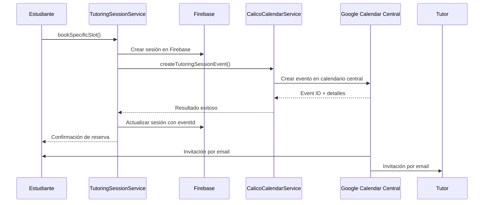

# Integración con Calendario Central de Calico

## Resumen

Este documento explica la nueva implementación de creación de eventos de sesiones de tutoría en el calendario central de Calico usando una Service Account de Google Calendar API, en lugar de depender de las credenciales del usuario autenticado.

## 🎯 Objetivos Alcanzados

### ✅ **Calendario Central Unificado**
- Todas las sesiones de tutoría se crean en un calendario central de Calico
- Los tutores y estudiantes reciben invitaciones automáticas por email
- Control centralizado de todos los eventos de tutoría

### ✅ **Service Account de Google**
- Autenticación independiente del usuario mediante Service Account
- No requiere tokens de usuario ni reautenticación
- Credenciales seguras almacenadas en variables de entorno

### ✅ **Integración Completa**
- Los eventos se crean automáticamente al reservar un slot de tutoría
- Sincronización bidireccional: Firebase + Google Calendar Central
- Gestión completa del ciclo de vida de eventos (crear, actualizar, cancelar)

## 🔧 Arquitectura

### **Servicios Principales**

#### 1. **CalicoCalendarService**
Ubicación: `src/app/services/CalicoCalendarService.js`

Responsabilidades:
- Autenticación con Service Account de Google
- Creación de eventos en calendario central
- Actualización y cancelación de eventos
- Gestión de invitados y notificaciones

#### 2. **TutoringSessionService** (Actualizado)
Ubicación: `src/app/services/TutoringSessionService.js`

Nuevas funcionalidades:
- Integración con `CalicoCalendarService`
- Creación simultánea: Firebase + Calendar Central
- Métodos de actualización con sincronización de calendario
- Cancelación con gestión de eventos de calendario

#### 3. **API Route de Eventos**
Ubicación: `src/app/api/tutoring-sessions/create-event/route.js`

Endpoints:
- `POST` - Crear evento de sesión de tutoría
- `PATCH` - Actualizar evento existente
- `DELETE` - Cancelar o eliminar evento

## ⚙️ Configuración

### **Variables de Entorno Requeridas**

```bash
# Service Account de Google Calendar (JSON como string)
GOOGLE_SERVICE_ACCOUNT_KEY={"type": "service_account", "project_id": "...", ...}

# ID del calendario central de Calico
CALICO_CALENDAR_ID=calico@your-domain.com
```

### **Configuración de Service Account**

1. **Crear Service Account en Google Cloud Console**
   - Ir a Google Cloud Console > IAM & Admin > Service Accounts
   - Crear nueva Service Account
   - Descargar clave JSON

2. **Configurar Permisos del Calendario**
   - Compartir el calendario central con el email de la Service Account
   - Dar permisos de "Make changes to events" (Modificar eventos)

3. **Variables de Entorno**
   - Convertir el JSON de la clave a string
   - Configurar `GOOGLE_SERVICE_ACCOUNT_KEY` con el JSON completo
   - Configurar `CALICO_CALENDAR_ID` con el ID del calendario

## 🔄 Flujo de Trabajo

### **1. Reserva de Tutoría**


### **2. Datos del Evento**

Cada evento de sesión de tutoría incluye:

```javascript
{
  summary: "Tutoría de Cálculo - María con Carlos",
  description: "Sesión de tutoría agendada a través de Calico...",
  start: { dateTime: "2025-01-22T14:00:00Z", timeZone: "America/Bogota" },
  end: { dateTime: "2025-01-22T15:00:00Z", timeZone: "America/Bogota" },
  location: "Biblioteca ML - Sala 101",
  attendees: [
    { email: "estudiante@uniandes.edu.co", displayName: "Carlos Mesa" },
    { email: "tutor@uniandes.edu.co", displayName: "María Rodríguez" }
  ],
  reminders: {
    overrides: [
      { method: "email", minutes: 1440 }, // 1 día antes
      { method: "popup", minutes: 30 }    // 30 min antes
    ]
  }
}
```

## 📚 Uso de la API

### **Crear Evento de Sesión**

```javascript
// POST /api/tutoring-sessions/create-event
const response = await fetch('/api/tutoring-sessions/create-event', {
  method: 'POST',
  headers: { 'Content-Type': 'application/json' },
  body: JSON.stringify({
    summary: "Tutoría de Cálculo",
    description: "Sesión de repaso de derivadas",
    startDateTime: "2025-01-22T14:00:00.000Z",
    endDateTime: "2025-01-22T15:00:00.000Z",
    studentEmail: "estudiante@uniandes.edu.co",
    studentName: "Carlos Mesa",
    tutorEmail: "tutor@uniandes.edu.co",
    tutorName: "María Rodríguez",
    location: "Sala 101",
    subject: "Cálculo Diferencial",
    notes: "Revisar ejercicios de límites"
  })
});

const result = await response.json();
// result.eventId -> ID del evento en Google Calendar
// result.htmlLink -> Link directo al evento
```

### **Actualizar Evento**

```javascript
// PATCH /api/tutoring-sessions/create-event?eventId=EVENT_ID
const response = await fetch(`/api/tutoring-sessions/create-event?eventId=${eventId}`, {
  method: 'PATCH',
  headers: { 'Content-Type': 'application/json' },
  body: JSON.stringify({
    location: "Nueva ubicación",
    start: { dateTime: "2025-01-22T15:00:00Z", timeZone: "America/Bogota" }
  })
});
```

### **Cancelar Evento**

```javascript
// DELETE /api/tutoring-sessions/create-event?eventId=EVENT_ID&action=cancel
const response = await fetch(`/api/tutoring-sessions/create-event?eventId=${eventId}&action=cancel`, {
  method: 'DELETE'
});
```

## 🔄 Integración en TutoringSessionService

### **Métodos Principales**

#### `createCalicoCalendarEvent(eventData)`
Crea un evento en el calendario central cuando se reserva una tutoría.

#### `updateTutoringSessionWithCalendar(sessionId, updateData)`
Actualiza tanto la sesión en Firebase como el evento en el calendario central.

#### `cancelTutoringSessionWithCalendar(sessionId, reason)`
Cancela la sesión y marca el evento como cancelado en el calendario.

### **Ejemplo de Uso**

```javascript
// Al reservar un slot
const result = await TutoringSessionService.bookSpecificSlot(
  slot, 
  studentEmail, 
  studentName, 
  notes
);
// Automáticamente crea evento en calendario central

// Al cancelar
await TutoringSessionService.cancelTutoringSessionWithCalendar(
  sessionId, 
  "Estudiante no puede asistir"
);
// Automáticamente cancela evento en calendario central
```

## 🔍 Campos de Firebase Actualizados

Las sesiones de tutoría ahora incluyen:

```javascript
{
  // ... campos existentes ...
  
  // Nuevos campos de calendario central
  "calicoCalendarEventId": "calico123abc456def789",
  "calicoCalendarHtmlLink": "https://calendar.google.com/calendar/event?eid=...",
  
  // Campos de cancelación (opcional)
  "cancelledAt": "2025-01-22T10:00:00Z",
  "cancellationReason": "Estudiante enfermo"
}
```

## ✅ Ventajas del Nuevo Sistema

### **1. Centralización**
- Todos los eventos en un solo calendario
- Visibilidad completa para administradores
- Gestión unificada de horarios

### **2. Automatización**
- Invitaciones automáticas por email
- Recordatorios configurados automáticamente
- Sincronización automática con cambios

### **3. Confiabilidad**
- No depende de tokens de usuario
- Service Account siempre disponible
- Manejo robusto de errores

### **4. Escalabilidad**
- Independiente del número de usuarios
- Performance consistente
- Fácil mantenimiento

## 🚨 Consideraciones Importantes

### **Seguridad**
- La Service Account key debe mantenerse segura
- Acceso limitado solo al calendario central
- No exponer credenciales en el frontend

### **Gestión de Errores**
- Si el calendario falla, la sesión en Firebase se crea igual
- Logs detallados para debugging
- Reintentos automáticos en casos apropiados

### **Límites de API**
- Google Calendar API tiene límites de quota
- Implementar rate limiting si es necesario
- Monitorear uso de API

## 🔄 Migración

### **Sesiones Existentes**
Las sesiones existentes seguirán funcionando normalmente. Los nuevos campos (`calicoCalendarEventId`, etc.) solo estarán presentes en sesiones creadas después de la implementación.

### **Compatibilidad**
El sistema es completamente compatible hacia atrás. Las funcionalidades existentes siguen funcionando sin cambios.

---

## 🚀 Resultado

Con esta implementación, **todas las sesiones de tutoría se crean automáticamente en el calendario central de Calico** usando una Service Account, enviando invitaciones automáticas a tutores y estudiantes, y manteniendo sincronización completa entre Firebase y Google Calendar. ¡El sistema ahora es más robusto, centralizado y profesional! 🎉
